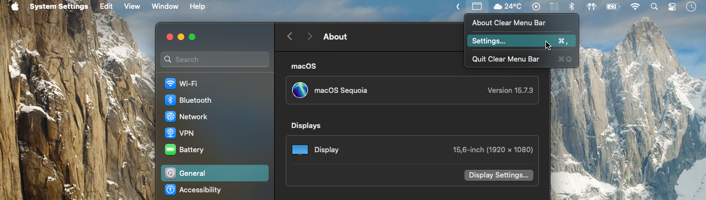

# Clear Menu Bar

> Make the macOS menu bar transparent.

## Features

- Supports single wallpaper or multiple wallpapers from a folder;
- Supports light and dark mode.
- The menu bar icon can be hidden by dragging it out. To bring it back, relaunch the app while it is already running.

## Feature Support

|                                                                         | Reduce Transparency **Off** | Reduce Transparency **On** |
|-------------------------------------------------------------------------|-----------------------------|----------------------------|
| Single Wallpaper (JPG or PNG image)                                     | ✅                          | ✅                         |
| Multiple Wallpapers from a Folder (JPG or PNG images)                   | ❌                          | ✅                         |
| Dynamic or Motion Wallpapers (Light/Dark mode or video support)         | ❌                          | ❌                         |

## Requirements

- Requires macOS 14 Sonoma or later.
- The Reduce Transparency option may need to be enabled in the Accessibility section of System Settings for this application to work as expected.
- The wallpaper needs to be set with the "Fill Screen" option.
- The wallpaper needs to be a static image. This app will not work with dynamic or aerial wallpapers.

## Contributing

Pull requests are welcome.

## License
[GNU General Public License](https://github.com/zorth64/ClearMenuBar/blob/master/LICENSE)